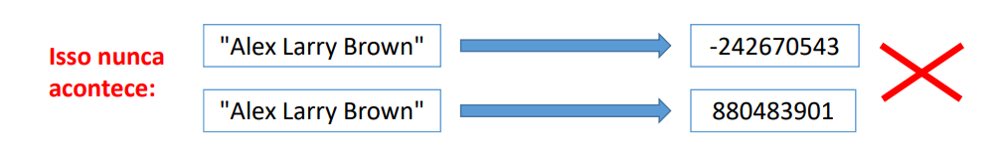
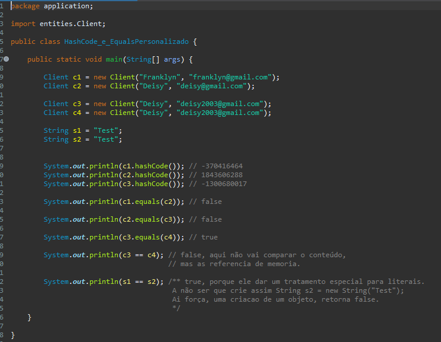

# HashCode e Equals

* São operações da classe Object utilizadas para comparar se um objeto é igual a outro.
* equals: lento, resposta 100%.
* hashCode: rápido, porém resposta positiva não é 100%.
* Tipos comuns (String, Date, Integer, Double, etc.) já possuem implementação para essas operações. Classes personalizadas precisam sobrepô-las.

## Equals

* Método que compara se o objeto é igual a outro, retornando true ou false.
```java
String a = "Maria";
String b = "Alex";

System.out.println(a.equals(b));
```
## HashCode
* Método que retorna um número inteiro representando um código gerado a partir das informações do objeto.
```java
String a = "Maria";
String b = "Alex";

System.out.println(a.hashCode());
System.out.println(b.hashCode());
```
## Regra de ouro do HashCode
* Se o hashCode de dois objetos for diferente, então os dois objetos são diferentes.
<p align="center">
    
</p>


* Se o código de dois objetos for igual, muito provavelmente os objetos são iguais (pode haver colisão).

## HashCode e Equals personalizados
```java
public class Client {

    private String name;
    private String email;
}
```
## O código
<p align="left">
    
</p>
